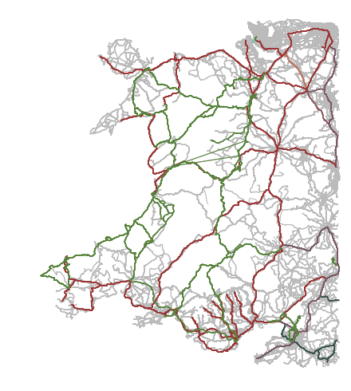

This is an OpenTripPlanner network graph for planning trips, by car or public transport, between places in Wales - including where these trips involve a short journey entirely within England. (It likely also works well enough for planning trips between places in Wales and a small number of English towns just the other side of the border.)

The map shows bus and train routes included in the latest graph, giving a rough idea of the region included.

## How to use this

The graph file was last updated at 09:46 BST on 26 April 2022. (The graph should update weekly.)

[Download the latest release of the Wales-ish OTP graph here](https://github.com/stupidpupil/wales_ish_otp_graph/releases/latest). You’ll need to download the *otp\_and\_graph.zip* asset.

You can then start OpenTripPlanner using *run-otp.bat* (under Windows) or *run-otp.sh* (under Linux or macOS). Eventually it’ll print “Started listener bound to \[0.0.0.0:8080\]” and you’ll be able to access the planner at `http://localhost:8080` .

(You’ll need [Java 11](https://adoptopenjdk.net/?variant=openjdk11&jvmVariant=hotspot). See the [OTP documentation](http://docs.opentripplanner.org/en/latest/) for more information.)

You can [see the code used to download source data and generate this graph here](https://github.com/stupidpupil/wales_ish_otp_graph).

## License

The *graph.obj* graph file is made available under the [ODbL v1.0](https://opendatacommons.org/licenses/odbl/1-0/) by Adam Watkins as part of the [Wales-ish OTP graph project](https://stupidpupil.github.io/wales_ish_otp_graph).

The graph file contains:

  - street map information obtained from [OpenStreetMap contributors](https://www.openstreetmap.org/copyright), via [Geofabrik.de](https://download.geofabrik.de/europe/great-britain.html), under the [ODbL v1.0](https://opendatacommons.org/licenses/odbl/1-0/),
  - heavy rail timetable information obtained from [RSP Limited (Rail Delivery Group)](http://data.atoc.org/) under the [CC-BY v2.0](https://creativecommons.org/licenses/by/2.0/uk/legalcode), and
  - bus and other public transport services timetable information obtained from [Traveline](https://www.travelinedata.org.uk/traveline-open-data/traveline-national-dataset/) and the [UK Department for Transport](https://data.bus-data.dft.gov.uk/) under the [OGL v3.0](https://www.nationalarchives.gov.uk/doc/open-government-licence/version/3/).

The graph file is provided without any warranty of any kind and without any endorsement by any of the individuals or organisations named above, for any purpose.

If you provide a routing service or similar using the graph file you should make sure that the above attributions are stated clearly. If you produce a set of routing instructions using such a routing service, these likely form a “derived database” and should also be provided under the [ODbL v1.0](https://opendatacommons.org/licenses/odbl/1-0/), again with the attributions above attached.

*otp.jar* is a copy of the version of [OpenTripPlanner](https://github.com/opentripplanner/OpenTripPlanner) used to generate the graph file; it is released under the [LGPL v3.0 (or later)](https://github.com/opentripplanner/OpenTripPlanner/blob/dev-2.x/LICENSE). Again, it is provided without any warranty of any kind and without any endorsement, for any purpose.

## Test Journeys

A small number of journeys, departing on Tuesday morning the following week, are tested every time that the graph is built. The results from the latest update of the graph are shown below.

| Description                      | Car   | Public |
| :------------------------------- | :---- | :----- |
| Abergavenny to Pontypridd        | 0h40m | 1h56m  |
| Bala to Cardiff                  | 3h43m | 4h40m  |
| Bangor Pier to Great Orme        | 0h46m | 1h38m  |
| Caerphilly to Cwmafan            | 0h51m | 1h59m  |
| Cardiff to Bala                  | 3h43m | 5h15m  |
| Cardiff to Sheffield             | N/A   | N/A    |
| Cardigan to Trawsfynydd          | 3h 4m | 4h43m  |
| Chirk to Walton                  | 1h32m | 4h17m  |
| CP2 to Secret Garden Cafe        | 0h 7m | 0h 9m  |
| Grangetown Library to UHW A\&E   | 0h23m | 0h47m  |
| Lampeter to Llandovery           | 0h33m | 5h26m  |
| Llangadog to Rhayader            | 1h14m | 2h30m  |
| Llangollen to Ruthin             | 0h29m | 1h11m  |
| Merthyr to Cardiff               | 0h48m | 1h26m  |
| Pontsticill to the Naughty Stone | 0h28m | 1h10m  |
| Rhosllanerchrugog to Denbigh     | 1h 2m | 1h48m  |
| Swansea to Bargoed               | 1h16m | 2h10m  |
| Swansea to Wrexham               | 3h47m | 5h 4m  |
| Treharris to Gellideg            | 0h21m | 0h43m  |
| Whitland to Cardigan             | 0h44m | 1h60m  |

## Thanks

This project developed out of a [NHS Welsh Modelling Collaborative](https://twitter.com/nhswmc) hackathon, with the support of colleagues across NHS Wales including James Cooke of the Welsh Ambulance Service.

It depends entirely on the work done by [OpenStreetMap contributors](https://www.openstreetmap.org/), [Malcolm Morgan (University of Leeds, Institute for Transport Studies) and UK2GTFS contributors](https://itsleeds.github.io/UK2GTFS/), [Traveline](https://www.travelinedata.org.uk/), the [*osmium* developers](https://osmcode.org/), and of course the [OpenTripPlanner developers](http://www.opentripplanner.org/).

Important inspiration included the [*graphite* project](https://github.com/datasciencecampus/graphite) produced as part of [a piece of work by the ONS Data Campus](https://datasciencecampus.ons.gov.uk/access-to-services-using-multimodal-transport-networks/). Also of note is the [*OTP4GB* project](https://github.com/odileeds/OTP4GB) and [other work by ODI Leeds](https://odileeds.org/blog/2021-06-08-transportaccessibilityinnorthengland).
